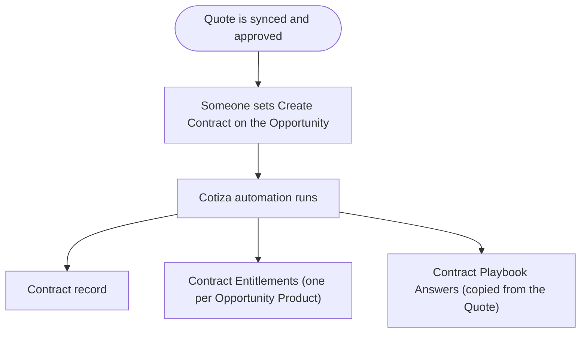

# Contracts Lifecycle

This admin guide covers Contract creation, adjustment configuration, and entitlement management.

## Contract creation flow

One checkbox on the Opportunity kicks off everything below. Read the diagram top to bottom: the trigger runs once, then Cotiza creates three related record types in parallel.

**Create Contract** on Opportunity is an automation flag. When changed from false to true, Apex triggers:

1. Create or update the Contract
2. Map Opportunity Products to Contract Entitlements
3. Store Playbook answers on Contract Playbook Answer records

## System Settings for contracts

| Setting | Purpose |
| --- | --- |
| **Amendments Maintain Contract** | Amend in place vs. create new Contract per amendment |
| **Force Quote From Contract** | Require contract-sourced Quotes for adjustments |
| **Contract Table Display Columns** | Columns on Contracts UI |
| **Contract Table Actions** | Amend, Replace, Renew, Void, View |
| **Show Most Active Contract Snapshot** | Account page snapshot widget |

See [System Settings](./system-settings.md).

## Adjustment types

| Type | Contract behavior |
| --- | --- |
| **Amendment** | Modify existing deal; playbook cannot change |
| **Replacement** | New deal structure; may switch playbook with Contract Playbook Answer support |
| **Renewal** | Extend term; contract status reflects renewal chain |

Renewal Quotes derive full-term pricing defaults from underlying contract entitlements rather than prorated list/unit values. See [Contracts and Amendments (User)](../user-guide/contracts-and-amendments.md#renewal-pricing-defaults).

Quote and Contract records store **Adjustment Type** and **Adjustment of Contract** (lookup to source Contract).

## Entitlement creation

When a Contract is created, Opportunity Products map to Contract Entitlements using:

- Default mappings in `Static_Values.cls`
- Custom [Entitlement Field Mapping](../objects/metadata/entitlement_field_mapping__mdt.md) records

## Entitlement combination

During amendments, multiple entitlements may merge into one. [Entitlement Combination Mapping](../objects/metadata/entitlement_combination_mapping__mdt.md) defines how field values combine:

| Operation | Behavior |
| --- | --- |
| Sum | Add numeric values |
| Sum Product | Evaluate the Custom Operation Formula for each adjustment entitlement and sum the results |
| Min / Max | Take minimum or maximum |
| Newest / Oldest | Take value from newest or oldest entitlement |
| Average | Average numeric values |
| Custom | Formula using piped entitlement field tokens |

Custom formulas support comparison operators and ternary expressions in addition to standard arithmetic.

Example custom formula: ` * `

Example discount formula (package default): ` !== 0 ? 1 - ( / ) : 0`

## Contract void

Voiding a Contract requires **Contracts** Power User access. Voided contracts remain in the system for audit but are no longer active for amendments.

## Playbook design for contracts

- Avoid separate playbooks per adjustment type (see [How Many Playbooks?](./how-many-playbooks.md))
- Use Rules to pull **Contract Playbook Answers** when playbooks change during replacement
- Configure **Contract View Display Fields** on the Playbook for the contract inspection UI

## Related guides

- [Contracts and Amendments (User)](../user-guide/contracts-and-amendments.md)
- [Field Mappings](./field-mappings.md)
- [Contract](../objects/transaction/contract.md)
