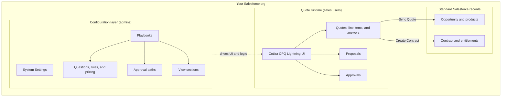

# Cotiza CPQ

**Point. Click. Quote.**

Cotiza CPQ is a fully native Salesforce Sales Cloud application for end-to-end deal management. It helps sales teams create accurate quotes, automate approvals, and generate professional proposals—without ever leaving Salesforce.

Designed for flexibility, Cotiza adapts to your sales process instead of forcing you into a rigid quoting structure.

---

## What Cotiza CPQ does

Cotiza brings the entire quoting lifecycle directly into Salesforce:

- Build dynamic, guided quotes based on deal context
- Automate approval routing and enforcement
- Generate branded proposal documents instantly
- Manage pricing, products, and configurations natively
- Extend quotes into subscriptions and renewals

---

## Core capabilities

### Dynamic Quoting
Build quotes through an intelligent, guided experience.

Fields, pricing logic, and product options adjust automatically based on user input—ensuring reps only see what’s relevant.

---

### Approval Automation
Define approval rules based on real-time deal conditions such as discounts, products, or deal size.

Cotiza automatically routes requests through the correct approval path with full auditability.

---

### Proposal Generation
Turn Salesforce data into polished, customer-ready documents.

Quotes can be converted into fully branded proposal PDFs that include:
- Line items
- Pricing breakdowns
- Customer and opportunity data
- Custom branding and layouts

---

### Subscriptions & Renewals
Extend beyond the initial deal.

Cotiza supports recurring revenue workflows by bringing closed deals back into CPQ for upgrades, renewals, and expansions.

---

### Native Salesforce Architecture
Cotiza runs entirely inside Salesforce.

- No external systems
- No data syncing layers
- No separate user management
- Fully aligned with Salesforce security and permissions

Everything below lives in your Salesforce org—configuration, quoting UI, approvals, proposals, and the standard records they update.

---

### Data-Driven Configuration
Your sales process is unique—Cotiza is built to match it.

- Toggle features on/off
- Configure workflows without code
- Adapt logic based on business rules

---

## Supported Salesforce Editions

Cotiza CPQ is supported on:

- Professional Edition
- Enterprise Edition
- Unlimited Edition
- Developer Edition

---

## How Cotiza fits into your workflow

1. A sales rep creates or opens an Opportunity
2. Cotiza guides the rep through dynamic quote creation
3. Pricing and product rules adjust automatically
4. The quote is submitted for approval if required
5. A proposal is generated directly from Salesforce data
6. The deal is finalized and can transition into subscriptions or renewals

---

## Next steps

To get started:

- Install Cotiza CPQ from the [Salesforce AppExchange](https://appexchange.salesforce.com/)
- Follow the [Installation Guide](./getting-started/installation.md)
- [Assign permissions](./getting-started/permissions.md) and complete the [Quick Start](./getting-started/quick-start.md)
- Set up your first quote workflow

---

## Learn more

### For administrators

- [Configuration Guide](./admin-guide/configuration.md)
- [Playbook Design](./admin-guide/playbook-design.md)
- [System Settings](./admin-guide/system-settings.md)
- [Object Model Overview](./objects/overview.md)

### For end users

- [Workflow Overview](./user-guide/workflow-overview.md)
- [Creating Quotes](./user-guide/creating-quotes.md)
- [Contracts and Amendments](./user-guide/contracts-and-amendments.md)

### Reference

- [UI Components](./ui-components/overview.md)
- [Glossary](./reference/glossary.md)