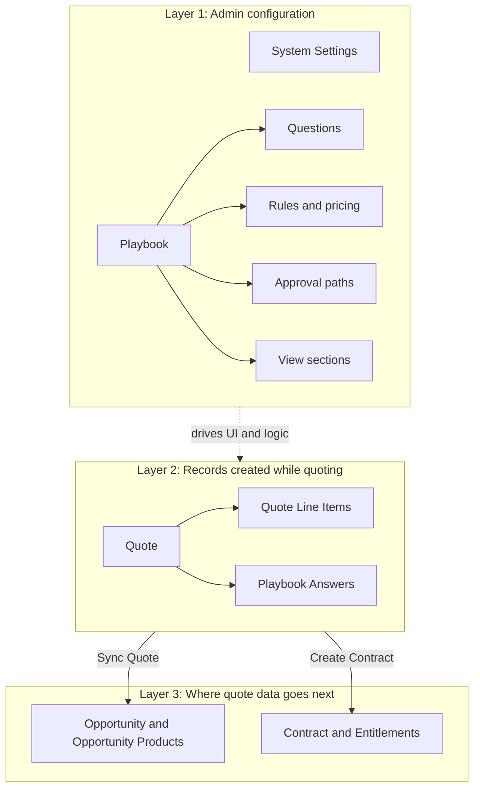

# Object Model Overview

Cotiza CPQ extends Salesforce with custom objects, standard object integrations, and custom metadata types. Together they form the data model that powers quoting, approvals, proposals, and contract management.

## Object categories

### Admin Objects

Configuration records that define how Cotiza CPQ behaves. Admins create and maintain these records to control playbooks, pricing, approvals, and display logic. User decisions during quoting are guided by this configuration.

See [Admin Objects](./admin/overview.md) for the full list and field reference.

### Transaction Objects

Output records created and updated as users work through the quoting process. These include Quotes, line items, approvals, proposals, and contract-related records.

See [Transaction Objects](./transaction/overview.md) for the full list and field reference.

### Custom Metadata Types

Deployment-friendly configuration used primarily for field mappings between records during sync and contract creation.

See [Custom Metadata Types](./metadata/overview.md) for the full list and field reference.

## How the categories relate

1. **Admin Objects** define playbooks, rules, questions, and approval paths.
2. Users interact with the CPQ UI, which reads admin configuration and writes **Transaction Objects**.
3. **Custom Metadata Types** control how transaction data maps to Opportunity, Opportunity Product, and Contract records when quotes are synced or finalized.

The diagram has two setup boxes (what admins build vs. what users create) and two exit paths (where quote data lands in Salesforce). Solid arrows show record relationships; the dashed arrow means "configuration drives the quoting UI."

