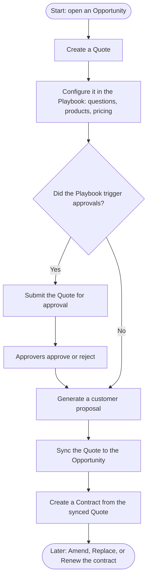

# End-to-End Workflow

This page describes the typical Cotiza CPQ lifecycle from Opportunity through Contract.

## Lifecycle overview

This is the happy path from first quote to ongoing contract changes. Follow the arrows downward; the diamond is the only branch — most quotes either need approval or skip straight to the proposal.

## Step-by-step

### 1. Open the Opportunity

Sales users start from the **Cotiza CPQ** app tab or the **Cotiza CPQ Container** on an Opportunity record page. The Opportunity must exist before a Quote can be created.

### 2. Create and configure a Quote

Select **Create +** and work through the active Playbook:

- Answer guided questions
- Add or adjust products (manually or via rules)
- Review required approvals

See [Creating Quotes](./creating-quotes.md) and [Quote Line Items](./quote-line-items.md).

### 3. Submit for approval (if required)

When Playbook Approvals are triggered, submit the Quote from the Approvals modal. Approvers act in the **Cotiza CPQ Approvals** tab.

See [Submitting for Approval](./submitting-approvals.md) and [Acting as an Approver](./acting-as-approver.md).

### 4. Generate a proposal

Once configuration is complete (and approvals are satisfied where required), generate a customer-ready PDF—or Word document for Proposal Power Users.

See [Generating Proposals](./generating-pdfs.md).

### 5. Sync to Opportunity

Sync the Quote to push field values to the Opportunity and create or update Opportunity Products from Quote Line Items.

See [Managing Quotes](./managing-quotes.md).

### 6. Create a Contract

After the synced Quote is approved, an admin or automated process sets **Create Contract** on the Opportunity. Cotiza creates Contract, Entitlement, and Contract Playbook Answer records.

See [Contracts and Amendments](./contracts-and-amendments.md).

### 7. Manage subscriptions

From the **Cotiza CPQ Contracts** tab or Account record page, users can view contracts and launch **Amend**, **Replace**, or **Renew** quotes for ongoing customer relationships.

## Roles at each stage

| Stage | Typical role | Permission |
| --- | --- | --- |
| Quote configuration | Sales rep | Cotiza CPQ User |
| Playbook / rule setup | CPQ admin | Cotiza CPQ Admin |
| Approval submission | Sales rep | Cotiza CPQ User |
| Approval decision | Approver | Cotiza CPQ User (+ optional Approvals Power User) |
| Proposal redlines / Word | Deal desk | Proposals Power User |
| Contract void | Operations admin | Contracts Power User |
| Full quote admin mode | CPQ admin | CPQ Power User |

See [Power Users](../admin-guide/power-users.md) for elevated capabilities.
